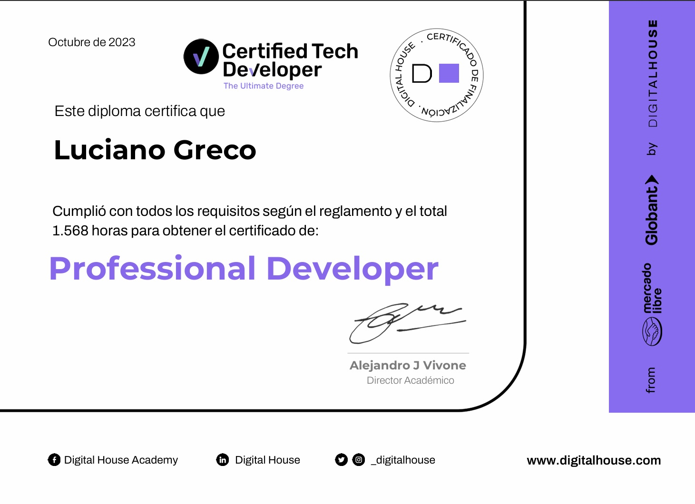

# 🚀 Introducción a la Informática

Este curso abarca los pilares fundamentales del mundo de la informática, incluyendo hardware, software, control de versiones, redes, sistemas operativos, ciberseguridad y lenguajes de programación. A través de un enfoque teórico-práctico, los estudiantes desarrollarán habilidades técnicas clave, aprendiendo a usar herramientas como la línea de comandos (CLI), Git, GitHub, y máquinas virtuales, y explorando conceptos como la arquitectura de computadoras, redes de Internet y protocolos de seguridad.

Al finalizar el curso, los participantes estarán capacitados para aplicar conocimientos básicos y avanzados en diversos campos tecnológicos, desde la administración de sistemas hasta la programación y la seguridad informática. Ideal para principiantes que deseen incursionar en el mundo de la tecnología o para quienes quieran reforzar habilidades ya adquiridas.

Este programa proporciona una formación integral y práctica, que ayudará a los estudiantes a destacarse en el competitivo campo de la informática.

[📄 Más detalles en Introducción a la Informática](./Introducción_a_la_Informática/README.md)

---

# 🎨 Frontend I

Este curso está diseñado para aquellos que deseen iniciarse o profundizar en el desarrollo frontend. A lo largo de cinco módulos, los estudiantes aprenderán los principios fundamentales del desarrollo web, comenzando con HTML y CSS, y avanzando hacia técnicas más complejas como flexbox, grid y animaciones CSS. Además, aprenderán a utilizar herramientas esenciales como Visual Studio Code, Figma y preprocesadores como SASS.

El curso combina teoría y práctica, con ejercicios integradores y proyectos que ayudarán a los estudiantes a desarrollar habilidades clave para trabajar en el mundo real. Al finalizar el curso, los estudiantes serán capaces de crear sitios web responsivos y visualmente atractivos, utilizando las mejores prácticas de desarrollo frontend.

[📄 Más detalles en Frontend I](./Frontend_I/README.md)

---

# 🚀 Metodologías de Trabajo Ágiles

Este curso tiene como objetivo introducir y profundizar en el uso de metodologías ágiles, proporcionando las herramientas necesarias para gestionar proyectos de manera eficiente en un entorno dinámico. A lo largo de tres módulos, los estudiantes aprenderán sobre la historia y evolución de las metodologías ágiles, los marcos de trabajo más importantes como Scrum, Lean y Kanban, y cómo aplicar estas prácticas al desarrollo de software mediante el uso de métricas, User Stories y testing ágil.

El curso se enfoca en proporcionar una formación completa tanto teórica como práctica, permitiendo a los estudiantes liderar y participar en proyectos ágiles en sus entornos de trabajo.

[📄 Más detalles en Metodologías de Trabajo Ágiles](./Metodologia_del_Trabajo/README.md)

---

# 🚀 Introducción a Bases de Datos

Este curso tiene como objetivo formar a los estudiantes en los fundamentos de las bases de datos, desde su instalación y configuración, hasta el diseño de diagramas entidad-relación (DER) y la optimización de consultas SQL. A lo largo de cinco módulos, se desarrollarán habilidades clave para trabajar con bases de datos relacionales, realizar consultas eficientes y aplicar buenas prácticas para mejorar el rendimiento de las aplicaciones que gestionan grandes volúmenes de datos.

Con un enfoque tanto teórico como práctico, este curso está diseñado para que los estudiantes puedan aplicar sus conocimientos en proyectos reales.

[📄 Más detalles en Introducción a Bases de Datos](./Base_de_datos/README.md)

---

# 🚀 Programación Imperativa

Este curso está diseñado para proporcionar a los estudiantes una comprensión sólida de los fundamentos de la programación imperativa, desde el pensamiento computacional hasta la implementación de algoritmos y técnicas avanzadas. A lo largo de cuatro módulos, se desarrollarán habilidades clave para trabajar con JavaScript y aplicar conceptos de programación a problemas del mundo real.

Con un enfoque práctico y teórico, los estudiantes tendrán la oportunidad de aprender y aplicar sus conocimientos en proyectos reales, preparándolos para un futuro en la programación.

[📄 Más detalles en Programación Imperativa](./Programacion_Imperativa/README.md)

---

# 🚀 Learning Agility

Este curso está diseñado para expandir la perspectiva del aprendizaje, enfocándose en la agilidad de aprendizaje como una herramienta clave para enfrentar los desafíos actuales del mercado laboral. A través de un enfoque práctico y reflexivo, los estudiantes aprenderán a adaptarse a nuevos entornos y a construir un perfil profesional más versátil y ejecutivo.

[📄 Más detalles en Learning Agility](./Learnin_Agility/README.md)

---

# 🚀 Programación Orientada a Objetos

Este curso está diseñado para introducir y profundizar en el paradigma de la programación orientada a objetos, utilizando Java como lenguaje de implementación. Los estudiantes aprenderán sobre los conceptos fundamentales de POO, su estructura, y cómo aplicarlos en el desarrollo de software.

[📄 Más detalles en Programación Orientada a Objetos](./Programacion_Orientado_a_Objetos/README.md)

---

# 🚀 Testing

Este curso está diseñado para proporcionar una comprensión profunda de los fundamentos de testing, la gestión de defectos y la implementación de pruebas en el desarrollo de software. A través de diversas técnicas y herramientas, los estudiantes aprenderán a mejorar la calidad del software y a optimizar los procesos de prueba.

[📄 Más detalles en Testing](./Testing/README.md)

---

# 🚀 Design Thinking

Este curso está diseñado para introducir a los estudiantes a la metodología Design Thinking, sus principios y aplicaciones en el diseño centrado en el usuario. A través de un enfoque práctico, se fomentará la creatividad y la colaboración para resolver problemas y crear soluciones efectivas.

[📄 Más detalles en Design Thinking](./Desing_Thinking/README.md)

---

# 🚀 Frontend II

Este curso está diseñado para profundizar en el desarrollo web utilizando JavaScript en el lado del cliente. Los estudiantes aprenderán a manipular el DOM, trabajar con formularios, manejar asincronismo y consumir APIs, además de aplicar animaciones y librerías para mejorar la experiencia del usuario.

[📄 Más detalles en Frontend II](./Frontend_II/README.md)

---

# 🚀 Infraestructura

Este curso está diseñado para proporcionar una comprensión integral de la infraestructura tradicional y moderna, así como los procesos y herramientas necesarias para administrarla de manera efectiva. A lo largo del curso, se abordarán temas esenciales como automatización, contenedores y computación en la nube, junto con conceptos de seguridad y gestión de servicios de TI.

[📄 Más detalles en Infraestructura](./Infraestructura_I/README.md)

---

# 🎨 Diseño UX / UI

Este curso está diseñado para ofrecer una comprensión profunda de los principios y prácticas del diseño de experiencia de usuario (UX) y de interfaz de usuario (UI). A través de un enfoque práctico y teórico, los estudiantes aprenderán a crear productos digitales centrados en el usuario, desde la investigación inicial hasta la evaluación final.

[📄 Más detalles en Diseño UX/UI](./UX-UI/README.md)

---

# 🔙 Backend

Este curso está diseñado para proporcionar una comprensión completa de los patrones de diseño y las mejores prácticas en el desarrollo de aplicaciones de backend. A través de una combinación de teoría y práctica, los estudiantes aprenderán a utilizar frameworks y herramientas que faciliten el desarrollo de aplicaciones robustas y escalables.

[📄 Más detalles en Backend](./Backend/README.md)

---

# 🗣️ Soft Skill Training - Comunicación Efectiva

Este curso está diseñado para ayudar a los participantes a desarrollar habilidades de comunicación efectivas en diferentes contextos. A través de clases teóricas y prácticas, los estudiantes aprenderán a reconocer la importancia de la comunicación y a diseñar conversaciones que sean apropiadas y efectivas.

[📄 Más detalles en Soft Skill Training](./Soft_Skill_Training/README.md)

---

# 🌐 Frontend III

Este curso está diseñado para llevar a los estudiantes a un nivel avanzado en React, profundizando en conceptos como la componentización, el manejo de estado y la implementación de herramientas para la creación de aplicaciones eficientes y efectivas.

[📄 Más detalles en Frontend III](./Frontend_III/README.md)

---

# 🤝 Team Work and Collaboration

Este curso está diseñado para ayudar a los estudiantes a comprender sus emociones y cómo estas impactan en el trabajo en equipo. Los participantes aprenderán a identificar y gestionar conflictos, a construir entornos colaborativos y a fomentar la eficacia del equipo.

[📄 Más detalles en Team Work and Collaboration](./Team_Work_and_Collaboration/README.md)

---

# 🏆 Certificado | Profesional Developer 

